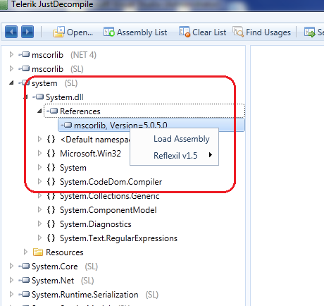
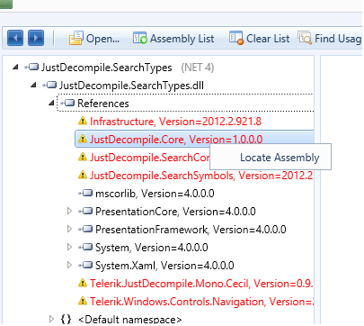
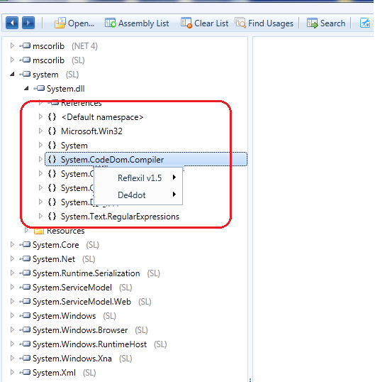
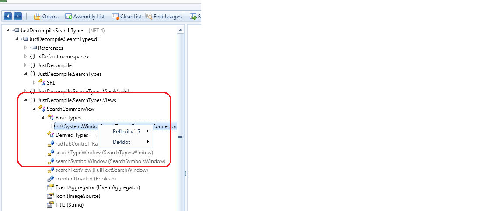
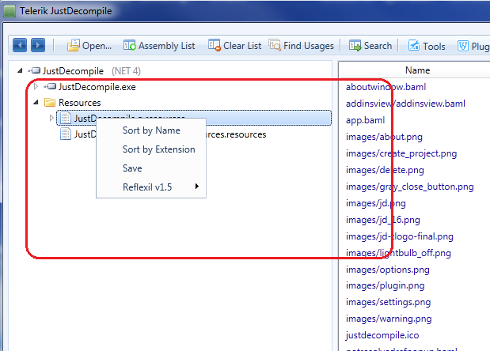
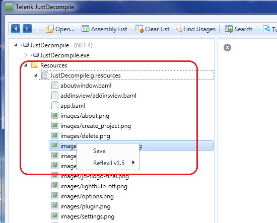
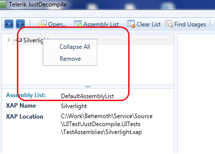

# Assemblies Tree Context Menu

JustDecompile employs a hierachy of context menus to enable a number of useful actions in the assembly list navigation tree. A number of
        [Prism](http://compositewpf.codeplex.com/) regions are defined in this hierarchy thus enabling plugins to insert their own menu items at any level.
    

The menu items residing in the regions listed below should implement the T:JustDecompile.API.Core.IMenuItem   interface.
    

* __AssemblyTreeViewContextMenuRegion:__
          All of the UI elements placed in this region will pop up in the assembly treeview item's context menu.
        

* __ModuleDefinitionTreeViewContextMenuRegion:__
          All of the UI elements placed in this region will pop up in the context menu displayed over assembly's module definition treeview item.
        

* __AssemblyReferenceTreeViewContextMenuRegion:__
          All of the UI elements placed in this region will pop up in the context menu displayed over an assembly reference treeview item.
        

* __UnResolvedAssemblyReferenceTreeViewContextMenuRegion:__
          All of the UI elements placed in this region will pop up in the context menu displayed over an unresolved (i.e. which location is unknown to JustDecompile) assembly reference treeview item.
        

* __NamespaceTreeViewContextMenuRegion:__
          All of the UI elements placed in this region will pop up in the context menu displayed over a namespace treeview item.
        

* __TypeTreeViewContextMenuRegion:__
          All of the UI elements placed in this region will pop up in the context menu displayed over a type treeview item.
        

* __BaseTypeTreeViewContextMenuRegion:__
          All of the UI elements placed in this region will pop up in the context menu displayed over a base type treeview item.
        

* __InheritTreeViewContextMenuRegion:__
          All of the UI elements placed in this region will pop up in the context menu displayed over a derived type treeview item.
        

* __MemberTreeViewContextMenuRegion:__
          All of the UI elements placed in this region will pop up in the context menu displayed over any type member treeview item.
        

* __DefaultResourceTreeViewContextMenuRegion:__
          All of the UI elements placed in this region will pop up in the context menu displayed over a resource collection treeview item.
        

* __ResourceTreeViewContextMenuRegion:__
          All of the UI elements placed in this region will pop up in the context menu displayed over a assembly resource treeview item.
        

* __EmbeddedResourceTreeViewContextMenuRegion:__
          All of the UI elements placed in this region will pop up in the context menu displayed over a child assembly resource treeview item.
        

* __XapTreeViewContextMenuRegion:__
          All of the UI elements placed in this region will pop up in the context menu displayed over a Silverlight XAP treeview item.
        

>tip  *The plugin view model should implement[INotifyPropertyChanged](http://msdn.microsoft.com/en-us/library/system.componentmodel.inotifypropertychanged.aspx)interface,
			      when it needs to provide dynamic property notification to the UI region where it's injected in.* 
>

